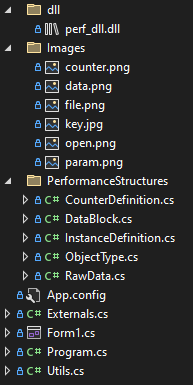
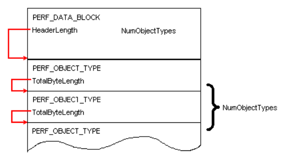
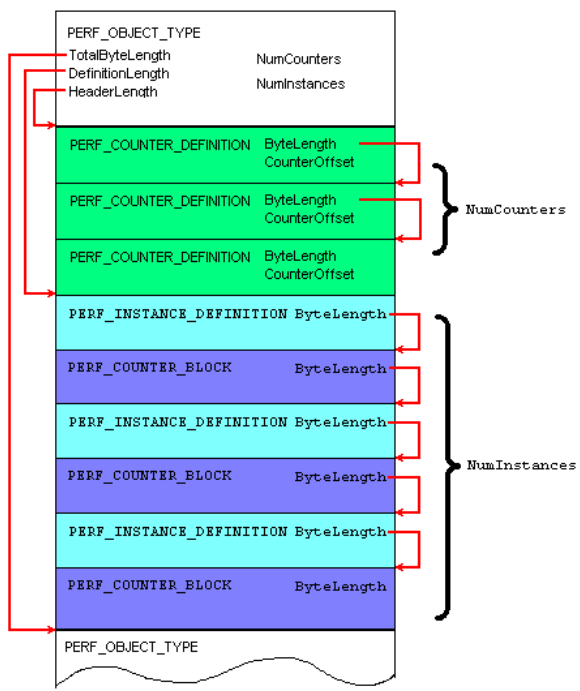
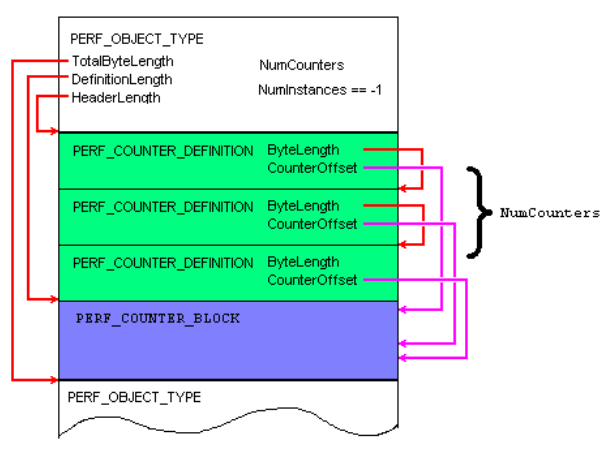
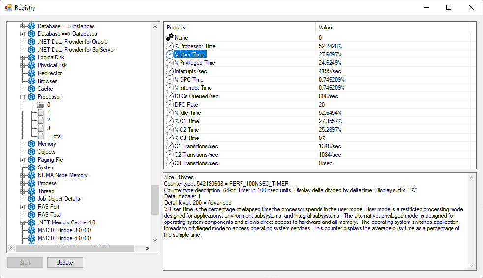

# Registry performance data

As we know, there are 5 registry hives:
1. HKEY_CLASSES_ROOT 
2. HKEY_CURRENT_USER 
3. HKEY_LOCAL_MACHINE 
4. HKEY_USERS 
5. HKEY_CURRENT_CONFIG.

But,  there is a final "hidden" registry hive, named **HKEY_PERFORMANCE_DATA**.     
This hive, which is simply not accessible except to applications written specifically to access performance data, is primarily dynamic in nature.       
This registry hive contains the necessary information to allow an application to successfully interact with and display performance data.       
Hidden from the Registry Editor, it is contained in a place in the registry that is only accessible programmatically; otherwise, it's not visible or editable.      
That HKEY_PERFORMANCE_DATA does not actually exist is an interesting part of Windows. Windows stores this hive temporarily, mostly in memory.
Quick updating of these performance-monitoring counters is necessary to avoid impacting performance.    
Windows has no need to store, on disk, performance data—this type of information is transient, constantly changing while the system is used.    
Although it is somewhat more difficult to access the performance hive than other registry hives, this difficulty can be overcome using the tools provided in the Windows header file, winperf.h, distributed with Visual C++.

### Purpose of work: retrieving data from HKEY_PERFORMANCE_DATA key.
### Project architecture
There are two projects in repository:
* DLL (C++)
* Windows Forms (C#)

### C++ DLL project
The main file with code is **perf_dll.cpp**. There are all used functions.  
Function's signatures are described in **perf_dll.h** header file.  
#### How to build
1. Open project (perf_dll.sln)
2. (In Visual Studio) Click Build -> Build solution
### C# Windows Forms project
   
**perf_dll.dll** - built DLL.    
**Images** - folder with icons for UI.  
**PerformanceStructures** - folder with auxiliary classes that partially imitate structures from the winperf.h header file. 
**Externals.cs** - class with external functions.   
**Form1.cs** - file with Form code. 
**Utils.cs** - Utils class.     

# Implementation
The HKEY_PERFORMANCE_DATA key is different from the others.     
For example, listing its subkeys using `RegEnumKeyEx` will not work.    
Access to the information in this section must be obtained using the `RegQueryValueEx` function (**Appendix A**).     
When accessing the HKEY_PERFORMANCE_DATA key, it needs to be used a little differently:

```cpp
#define BUFFERSIZE 750000
#define INCREMENT 1024
...
DWORD bufferSize = BUFFERSIZE;
PPERF_DATA_BLOCK perfDataBlock = (PPERF_DATA_BLOCK)malloc(bufferSize);

while (RegQueryValueEx(
	HKEY_PERFORMANCE_DATA, // Go into HKEY_PERFORMANCE_DATA key
	L"Global",  // "Global" counters
	NULL,
	NULL,
	(LPBYTE)perfDataBlock,	// Pointer to performance data block
	&bufferSize) == ERROR_MORE_DATA) 
	{	// The buffer is too small, so expand it!
	bufferSize += INCREMENT;
	perfDataBlock = (PPERF_DATA_BLOCK)realloc(perfDataBlock, bufferSize);
}
```
As the second parameter, it needs to specify a set of counters in the form of a null-terminated string:
* "Global" – the main set of counters.
* "Costly" – counters that take a long time to collect data.
* List of indexes of required counters separated by spaces, for example: "230 232 740".

Features that distinguish this code from the usual use of `RegQueryValueEx`:
* HKEY_PERFORMANCE_DATA is used as a handle to the registry key.
* The string used as the value is not a regular value.
* The size of the returned data changes dynamically, so it is not possible to predict the required buffer size in advance.
* The main difference is the returned data.

After calling the `RegQueryValueEx` function, the following sequence of actions occurs:
1. The function opens key **HKLM\System\CurrentControlSet\Services** and looks through all the subkeys.
2. In each of them, function looks for the **"Performance"** subkey
3. If it finds it, it reads the parameters:
   * **"Library"** - name of the dll that returns the data.
   * **"Object List"** – list of indexes of returned counters.
   * **"Open"** - name of the dll initialization function.
   * **"Collect"** - name of the function that returns the values of counters.
   * **"Close"** - name of the function to be called when the dll is no longer needed.
4. If the **"Object List"** contains the index of the required counter, then the function loads the dll and calls the **"Open"** function.
5. The **"Collect"** function is called, where the buffer is passed and dll fills it with a data block. If everything is ok, then `ERROR_SUCCESS` is returned, if the buffer is too small, then `ERROR_MORE_DATA`.
6. All data blocks from all dlls are collected together, the `PERF_DATA_BLOCK` structure is added to them in front and returned in the fifth parameter `lbcbData` of the `RegQueryValueEx` function.

As a result, `RegQueryValueEx` returns `ERROR_SUCCESS` and a large data structure 
(hundreds of kilobytes) in the fifth parameter `lpcbData`, or `ERROR_MORE_DATA` and then `lpcbData` 
is undefined. When getting `ERROR_MORE_DATA`, allocate a larger buffer and call the `RegQueryValueEx` 
function again until it returns `ERROR_SUCCESS`.

The data returned by `RegQueryValueEx` has a clear hierarchy:
* At the top level is the entire block of data as a whole. It is described by the `PERF_DATA_BLOCK` structure (**Appendix B**).
* After it are information blocks for each object.

    
Their number is specified in the `NumObjectTypes`
field of the `PERF_DATA_BLOCK` structure. At the beginning of the information block there is a header 
in the form of a `PERF_OBJECT_TYPE` structure (**Appendix C**).
* Then there are descriptions of all counters available for this type of object, in the form of 
`PERF_COUNTER_DEFINITION` structures (**Appendix D**). Their number is defined in the `NumCounters` 
field of the `PERF_OBJECT_TYPE` structure.

Then there are two options:
1. If an object type has instances, then blocks with descriptions of these instances follow. 

    
The number of these blocks is in the `NumInstances` field of the `PERF_OBJECT_TYPE` structure. 
At the beginning of each block is the `PERF_INSTANCE_DEFINITION` structure (**Appendix E**). It is followed by 
a `PERF_COUNTER_BLOCK` structure (**Appendix F**) with a single `ByteLength` field: the size of the counter data 
block, including the size of the `PERF_COUNTER_BLOCK` structure. Then the actual counter data 
for the object instance. The data offset of each counter from the start of the `PERF_COUNTER_BLOCK` 
is stored in the `CounterOffset` field of the `PERF_COUNTER_DEFINITION` structure.
2. If the object has no instances, then all counters are related to the object type itself. 
In this case, `PERF_COUNTER_DEFINITION` is immediately followed by only one counter data block, 
beginning with `PERF_COUNTER_BLOCK`



All performance data is contained in the **HKEY_PERFORMANCE_DATA** hive, except for object/counter 
names and reference information. They are contained in the registry key 
**HKEY_LOCAL_MACHINE\Software\Microsoft\WindowsNT\CurrentVersion\Perflib**

To get the value of the counter, it is not enough to know its offset. 
You need to know the size of the data and its type. 
All this can be determined by the `CounterType` field. 
It consists of bit fields that define various counter properties:

| First bit | End bit | Description                                                                                                                                                                                                                                                                                                                                                                                                                                                                                                                                                                                                                                                                                                                                                                                                                                                                                                                                                  |
|:---------:|:-------:|--------------------------------------------------------------------------------------------------------------------------------------------------------------------------------------------------------------------------------------------------------------------------------------------------------------------------------------------------------------------------------------------------------------------------------------------------------------------------------------------------------------------------------------------------------------------------------------------------------------------------------------------------------------------------------------------------------------------------------------------------------------------------------------------------------------------------------------------------------------------------------------------------------------------------------------------------------------|
|     0     |    7    | Reserved                                                                                                                                                                                                                                                                                                                                                                                                                                                                                                                                                                                                                                                                                                                                                                                                                                                                                                                                                     |
|     8     |    9    | Size field indicating the size, ranging from 0 to variable-length binary<br/><br/>00 = Displays a DWORD-sized counter (32 bits)<br/> 01 = Displays a large-sized counter.<br/> 10 = Displays a zero-length counter.<br/> 11 = Displays a variable-length counter.                                                                                                                                                                                                                                                                                                                                                                                                                                                                                                                                                                                                                                                                                            |
|    10     |   11    | The counter's type: number/counter/text/0<br/><br/>00 = Displays a number that is not a counter.<br/>01 = Displays a counter that increases as time passes.<br/>10 = Displays a text field.<br/>11 = Displays as a zero.                                                                                                                                                                                                                                                                                                                                                                                                                                                                                                                                                                                                                                                                                                                                     |
|    12     |   15    | Reserved                                                                                                                                                                                                                                                                                                                                                                                                                                                                                                                                                                                                                                                                                                                                                                                                                                                                                                                                                     |
|    16     |   19    | Subtype, varies depending on the type of counter.<br/><br/>If the counter is number (00), then:<br/> 0000 = Displays as a hexadecimal value.<br/>0001 = Displays as a decimal integer.<br/>0010 = Displays as a decimal integer / 1000.<br/><br/>If the counter is increasing number (01) then:<br/>0000 = Displays the counter value without modification.<br/>0001 = Displays the counter divided by the time since the previous counter value. <br/>0010 = Displays the counter divided by a base value.<br/>0011 = Contains the base value used in fractions.<br/>0100 = Displays the counter subtracted from the current time.<br/>0101 = Displays using the Quelen processing function.<br/>0110 = Begins or ends a standard histogram.<br/>0111 = Displays the counter divided by a private clock.<br/><br/>If the counter is text, then:<br/>0000 = Type of text is in the text field.<br/>0001 = Display the text as ASCII using the CodePage field |
|    20     |   21    | The timer base for the counter: either timer ticks, timer 100 nanoseconds, or an object-based timer.<br/><br/>00 = Uses the system timer tick as the base.<br/>01 = Uses a 100-nanosecond timer base for the counter.<br/>10 = Uses the object timer frequency.                                                                                                                                                                                                                                                                                                                                                                                                                                                                                                                                                                                                                                                                                              |
|    22     |   23    | Calculation modifier, used for delta counters.<br/><br/>01 = First computes the difference between the two values.<br/>10 = Shows both the difference and the base difference.                                                                                                                                                                                                                                                                                                                                                                                                                                                                                                                                                                                                                                                                                                                                                                               |
|    24     |   27    | Calculation modifier, used with inverse or multicounters.<br/><br/>01 = Shows as a 1.0 value.<br/>10 = Shows as the cumulative result of multiple values.                                                                                                                                                                                                                                                                                                                                                                                                                                                                                                                                                                                                                                                                                                                                                                                                    |
|    28     |   31    | Format flag, describing how to display this counter's data.<br/><br/>0000 = Displays no suffix.<br/>0001 = Displays the suffix "/Sec".<br/>0010 = Displays the suffix "%".<br/>0011 = Displays the suffix "Secs".<br/>0100 = Displays no value.                                                                                                                                                                                                                                                                                                                                                                                                                                                                                                                                                                                                                                                                                                              |

In total, there are about **39** types of counters, each with its own rules for calculating the 
value and displaying. So the counter can be a simple number, a text string, just zero, or a 
constantly changing counter. **In the latter case, the real value is calculated using special formulas 
using data from other counters and fields of the structures described above**.

Many counters need 2 measurements to display the real value. For example, the CPU 
usage of a process is reported in the "% Processor Time" counter, which is of type 
`PERF_100NSEC_TIMER`. To get the actual load value in percent, you need to remove two 
consecutive counter values and use the formula: 100*(X1-X0)/(Y1-Y0), where X0 and X1 
are the counter values, and Y0 and Y1 are the values of the `PERF_DATA_BLOCK`. `PerfTime100nSec` 
field during counter data acquisition time.

After building the DLL, you need to connect it to the project and declare the necessary functions.  
For example, the library defines the `GetInstanceInfo` function to get information about the `PERF_INSTANCE_DEFINITION` structure:
```cpp
extern "C" __declspec(dllexport) int GetInstanceInfo(
    PPERF_INSTANCE_DEFINITION p,
    DWORD CodePage,
    DWORD* ByteLenght,
    DWORD* ParentObjectTitleIndex,
    DWORD* ParentObjectInstance,
    WCHAR* Name);
```
In C# code, it should be declared like this:
```csharp
[DllImport("dll\\perf_dll.dll",CallingConvention=CallingConvention.Cdecl,Charset=Charset.Unicode)]
public static extern int GetInstanceInfo (
    UintPtr p,
    int CodePage,
    out int ByteLenght,
    out int ParentObjectTitleIndex,
    out int ParentObjectInstance,
    StringBuilder Name);
```
Since the data types in these languages are different, the C++ data types must be replaced with 
their C# counterparts. For example: 
* `PPERF_INSTANCE_DEFINITION` → `UIntPtr`
* `DWORD` → `int`
* `DWORD*` → `out int`
* `WCHAR*` → `StringBuilder`

After starting the program, you can see the structure of the HKEY_PERFORMANCE_DATA hive 
and the calculated values of all available counters:


# Appendices

### Appendix A: *RegQueryValueEx* function (winreg.h)
```cpp
LSTATUS RegQueryValueEx (
    HKEY 	hkey,		// Key handler
    LPCSTR 	lpValueName,	// Value name address
    LPDWORD 	lpReserved,	// Reserved (NULL)
    LPDWORD 	lpType,		// Variable for type address
    LPBYTE 	lpData,		// Data buffer address
    LPDWORD 	lpcbData	// Data buffer size value address
);
```

### Appendix B: PERF_DATA_BLOCK struct (winperf.h)
```cpp
typedef struct _PERF_DATA_BLOCK {
    WCHAR           Signature[4];       // Signature: Unicode "PERF"
    DWORD           LittleEndian;       // 0 = Big Endian, 1 = Little Endian
    DWORD           Version;            // Version of these data structures starting at 1
    DWORD           Revision;           // Revision of these data structures starting at 0 for each Version
    DWORD           TotalByteLength;    // Total length of data block
    DWORD           HeaderLength;       // Length of this structure
    DWORD           NumObjectTypes;     // Number of types of objects being reported
    LONG            DefaultObject;      // Object Title Index of default object to display when data from
                                        // this system is retrieved (-1 = none, but this is not expected to be used)
    SYSTEMTIME      SystemTime;         // Time at the system under measurement
    LARGE_INTEGER   PerfTime;           // Performance counter value at the system under measurement
    LARGE_INTEGER   PerfFreq;           // Performance counter frequency at the system under measurement
    LARGE_INTEGER   PerfTime100nSec;    // Performance counter time in 100 nsec units at the system under measurement
    DWORD           SystemNameLength;   // Length of the system name
    DWORD           SystemNameOffset;   // Offset, from beginning of this structure, to name of system being measured
} PERF_DATA_BLOCK, *PPERF_DATA_BLOCK;
```

### Appendix C: PERF_OBJECT_TYPE struct (winperf.h)
```cpp
typedef struct _PERF_OBJECT_TYPE {
    DWORD           TotalByteLength;    // Length of this object definition including this structure, the
                                        // counter definitions, and the instance definitions and the
                                        // counter blocks for each instance: This is the offset from this
                                        // structure to the next object, if any
    DWORD           DefinitionLength;   // Length of object definition, which includes this structure
                                        // and the counter definition structures for this object: this
                                        // is the offset of the first instance or of the counters
                                        // for this object if there is no instance
    DWORD           HeaderLength;       // Length of this structure: this is the offset to the first
                                        // counter definition for this object
    DWORD           ObjectNameTitleIndex;
                                        // Index to name in Title Database
#ifdef _WIN64
    DWORD           ObjectNameTitle;    // Should use this as an offset
#else
    LPWSTR          ObjectNameTitle;    // Initially NULL, for use by analysis program to point to
                                        // retrieved title string
#endif
    DWORD           ObjectHelpTitleIndex;
                                        // Index to Help in Title Database
#ifdef _WIN64
    DWORD           ObjectHelpTitle;    // Should use this as an offset
#else
    LPWSTR          ObjectHelpTitle;    // Initially NULL, for use by analysis program to point to
                                        // retrieved title string
#endif
    DWORD           DetailLevel;        // Object level of detail (for controlling display complexity);
                                        // will be min of detail levels for all this object's counters
    DWORD           NumCounters;        // Number of counters in each counter block (one counter
                                        // block per instance)
    LONG            DefaultCounter;     // Default counter to display when this object is selected, index
                                        // starting at 0 (-1 = none, but this is not expected to be used)
    LONG            NumInstances;       // Number of object instances for which counters are being
                                        // returned from the system under measurement. If the object defined
                                        // will never have any instance data structures (PERF_INSTANCE_DEFINITION)
                                        // then this value should be -1, if the object can have 0 or more instances,
                                        // but has none present, then this should be 0, otherwise this field
                                        // contains the number of instances of this counter.
    DWORD           CodePage;           // 0 if instance strings are in UNICODE, else the Code Page of
                                        // the instance names
    LARGE_INTEGER   PerfTime;           // Sample Time in "Object" units
                                        
    LARGE_INTEGER   PerfFreq;           // Frequency of "Object" units in counts per second.
} PERF_OBJECT_TYPE, *PPERF_OBJECT_TYPE;
```

### Appendix D: PERF_COUNTER_DEFINITION struct (winperf.h)
```cpp
typedef struct _PERF_COUNTER_DEFINITION {
    DWORD           ByteLength;         // Length in bytes of this structure
    DWORD           CounterNameTitleIndex;
                                        // Index of Counter name into Title Database
#ifdef _WIN64
    DWORD           CounterNameTitle;
#else
    LPWSTR          CounterNameTitle;   // Initially NULL, for use by analysis program to point to
                                        // retrieved title string
#endif
    DWORD           CounterHelpTitleIndex;
                                        // Index of Counter Help into Title Database
#ifdef _WIN64
    DWORD           CounterHelpTitle;
#else
    LPWSTR          CounterHelpTitle;   // Initially NULL, for use by analysis program to point to
                                        // retrieved title string
#endif
    LONG            DefaultScale;       // Power of 10 by which to scale chart line if vertical axis is 100
                                        // 0 ==> 1, 1 ==> 10, -1 ==>1/10, etc.
    DWORD           DetailLevel;        // Counter level of detail (for controlling display complexity)
    DWORD           CounterType;        // Type of counter
    DWORD           CounterSize;        // Size of counter in bytes
    DWORD           CounterOffset;      // Offset from the start of the PERF_COUNTER_BLOCK to the first
                                        // byte of this counter
} PERF_COUNTER_DEFINITION, *PPERF_COUNTER_DEFINITION;
```

### Appendix E: PERF_INSTANCE_DEFINITION struct (winperf.h)
```cpp
typedef struct _PERF_INSTANCE_DEFINITION {
    DWORD           ByteLength;         // Length in bytes of this structure, including the subsequent name
    DWORD           ParentObjectTitleIndex;
                                        // Title Index to name of "parent" object (e.g., if thread, then
                                        // process is parent object type); if logical drive, the physical
                                        // drive is parent object type
    DWORD           ParentObjectInstance;
                                        // Index to instance of parent object type which is the parent of this
                                        // instance.
    LONG            UniqueID;           // A unique ID used instead of matching the name to identify
                                        // this instance, -1 = none
    DWORD           NameOffset;         // Offset from beginning of this struct to the Unicode name
                                        // of this instance
    DWORD           NameLength;         // Length in bytes of name; 0 = none; this length includes the characters
                                        // in the string plus the size of the terminating NULL char. It does not
                                        // include any additional pad bytes to correct structure alignment
} PERF_INSTANCE_DEFINITION, *PPERF_INSTANCE_DEFINITION;
```

### Appendix F: PERF_COUNTER_BLOCK struct (winperf.h)
```cpp
typedef struct _PERF_COUNTER_BLOCK {
    DWORD           ByteLength;         // Length in bytes of this structure, including the following counters
} PERF_COUNTER_BLOCK, *PPERF_COUNTER_BLOCK;
```
# Used sources
1. Peter Hipson - Mastering Windows XP Registry / Copyright © 2002 SYBEX Inc., 1151 Marina Village Parkway, Alameda, CA 94501 - 556 p.
2. HKEY_PERFORMANCE_DATA – виртуальный реестр // Страничка tripsin’a –  Mode of access:  http://tripsin.narod.ru/articles/virtreg/virtregistry.htm - Date of access: 10.12.2021.
3. Счётчики производительности // RSDN. –  Mode of access:  https://www.rsdn.org/?article/baseserv/perfcounters1.xml – Date of access: 10.12.2021.
4. Retrieving Counter Data // Microsoft –  Mode of access:  https://docs.microsoft.com/en-us/windows/win32/perfctrs/retrieving-counter-data - Date of access: 10.12.2021.
5. Calculating Counter Values // Microsoft – Mode of access: https://docs.microsoft.com/en-us/windows/win32/perfctrs/calculating-counter-values – Date of access: 10.12.2021.
6. Using the Registry Functions to Consume Counter Data // Microsoft. – Mode of access:https://docs.microsoft.com/en-us/windows/win32/perfctrs/using-the-registry-functions-to-consume-counter-data – Date of access: 10.12.2021
